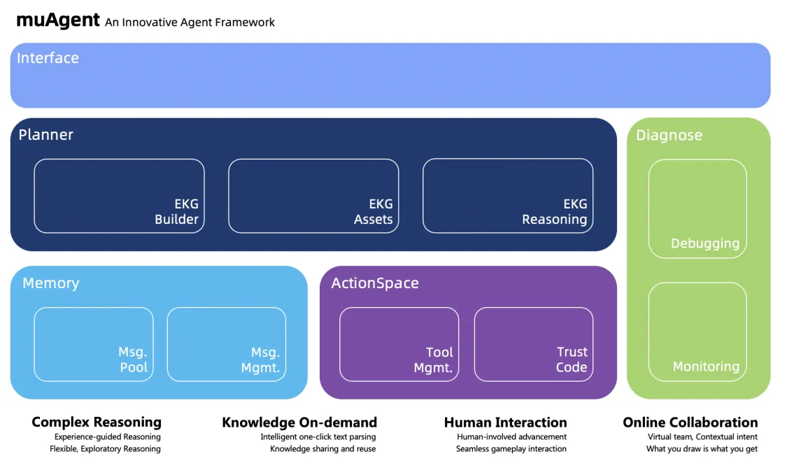
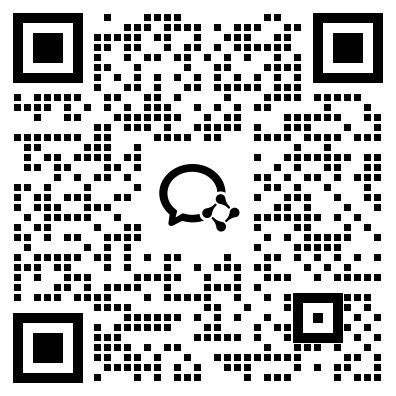

<p align="left">
    <a href="README_zh.md">中文</a>&nbsp ｜ &nbsp<a>English&nbsp </a>
</p>

# <p align="center">muAgent: An Innovative Agent Framework Driven by KG Engine</p>

<p align="center">
    <a href="README.md"></a>
    <a href="README_en.md"></a>
    <a href="LICENSE.md">
    <a href="https://github.com/codefuse-ai/CodeFuse-muAgent/issues">
      
    </a>
    <br><br>
</p>


## 🔔 News
- [2024.04.01] muAgent is now open source, focusing on multi-agent orchestration and collaborating with technologies such as FunctionCall, RAG, and CodeInterpreter.
- [2024.09.05] we release muAgent v2.0: An Innovative Agent Framework Driven By KG Engine.


## 📜 Contents
- [🤝 Introduction](#-Introduction)
- [🚀 QuickStart](#-QuickStart)
- [🧭 Features](#-Features)
- [🤗 Contribution](#-Contribution)
- [🗂 Miscellaneous](#-Miscellaneous)
  - [📱 Contact Us](#-Contact-Us)


## 🤝 Introduction
<p align="justify">
A brand new Agent Framework driven by LLM and EKG(Eventic Knowledge Graph,  Industry Knowledge Carrier)，collaboratively utilizing MultiAgent, FunctionCall, CodeInterpreter, etc. Through canvas-based drag-and-drop and simple text writing, the large language model can assists you in executing various complex SOP under human guidance. It is compatbile with existing frameworks on the market and can achieve four core differentiating technical functions: Complex Reasoning, Online Collaboration, Human Interaction, Knowledge On-demand.
This framework has been validated in multiple complex DevOps scenarios within Ant Group. At the sametime, come and experience the Undercover game we quickly built!
</p>
<div align="center">
  
</div>

## 🚀 QuickStart
For complete documentation, see: [CodeFuse-muAgent](https://codefuse.ai/docs/api-docs/MuAgent/overview/multi-agent)
For more [demos](https://codefuse.ai/docs/api-docs/MuAgent/connector/customed_examples)


### EKG Services

```bash
# use ekg services only three steps
# step1. git clone
git clone https://github.com/codefuse-ai/CodeFuse-muAgent.git

# step2. 
cd CodeFuse-muAgent

# step3. start all container services, it might cost some time
docker-compose up -d
```

The current image version includes only the basic EKG service. We expect to provide a front-end interface and back-end interaction services in September. 

To Be Continued!


### SDK 
We also provide a version of the SDK for using muagent.
1. Installation
```
pip install codefuse-muagent
```

2. Code answer Prepare related llm and embedding model configurations
you can see [docs](https://codefuse.ai/docs/api-docs/MuAgent/connector/customed_examples) and [~/examples](https://github.com/codefuse-ai/CodeFuse-muAgent/tree/main/examples)


## 🧭 Features
- **EKG Builder**：Through the design of virtual teams, scene intentions, and semantic nodes, you can experience the differences between online and local documentation, or annotated versus unannotated code handover. For a vast amount of existing documents (text, diagrams, etc.), we support intelligent parsing, which is available for one-click import.
- **EKG Assets**：Through comprehensive KG Schema design—including Intention Nodes, Workflow Nodes, Tool Nodes, and Character Nodes—we can meet various SOP Automation requirements. The inclusion of Tool Nodes in the KG enhances the accuracy of tool selection and parameter filling. Additionally, the incorporation of Characters (whether human or agents) in the KG allows for human-involved process advancement, making it flexible for use in multiplayer text-based games.
- **EKG Reasoning**：Compared to purely model-based or entirely fix-flow Reasoning, our framework allows LLM to operate under human guidance-flexibility, control, and enabling exploration in unknown scenarios. Additionally, successful exploration experiences can be summarized and documented into KG, minimizing detours for similar issues.
- **Diagnose**：After KG editing, visual interface allows for quick debugging, and successful Execution path configurations will be automatically documented, which reduces model interactions, accelerates inference, and minimizes LLM Token costs. Additionally, during online execution, we provide comprehensive end-to-end visual monitoring.
- **Memory**：Unified message pooling design supports categorized message delivery and subscription based on the needs of different scenarios, like multi-agent. Additionally, through message retrievel, rerank and distillation, it facilitates long-context handling, improving the overall question-answer quality.
- **ActionSpace**：Adhering to Swagger protocol, we provide tool registration, tool categorization, and permission management, facilitating LLM Function Calling. We offer a secure and trustworthy code execution environment, and ensuring precise code generation to meet the demands of various scenarios, including visual plot, numerical calculations, and table editing.

## 🤗 Contribution
We are deeply grateful for your interest in the Codefuse project and warmly welcome any suggestions, opinions (including criticism), comments, and contributions. 

Feel free to raise your suggestions, opinions, and comments directly through GitHub Issues. There are numerous ways to participate in and contribute to the Codefuse project: code implementation, writing tests, process tool improvements, documentation enhancements, etc. 

We welcome any contribution and will add you to the list of contributors. See [Contribution Guide...](https://codefuse-ai.github.io/contribution/contribution)


## 🗂 Miscellaneous
### 📱 Contact Us
<div align=center>
  
</div>
