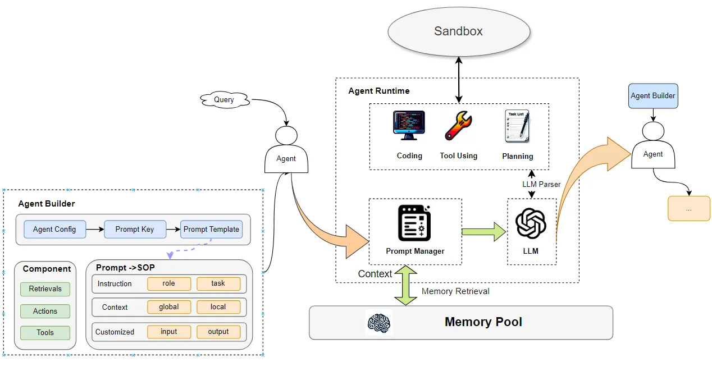

<p align="left">
    <a>中文</a>&nbsp ｜ &nbsp<a href="README.md">English&nbsp </a>
</p>

# <p align="center">CodeFuse-muAgent: A Multi-Agent FrameWork For Faster Build Agents</p>

<p align="center">
    <a href="README_zh.md"></a>
    <a href="README.md"></a>
    
    <a href="https://github.com/codefuse-ai/CodeFuse-muAgent/issues">
      
    </a>
    <br><br>
</p>


## 🔔 更新
- [2024.04.01] CodeFuse-muAgent 开源，支持知识库、代码库、工具使用、代码解释器等功能

## 📜 目录
- [🤝 介绍](#-介绍)
- [🚀 快速使用](#-快速使用)
- [🧭 关键技术](#-关键技术)
- [🗂 其他](#-其他)
  - [📱 联系我们](#-联系我们)


## 🤝 介绍
CodeFuse-muAgent 是蚂蚁CodeFuse团队开发的Mulit Agent框架，其核心宗旨在于简化agents的标准操作程序（SOP）编排流程。muagent整合了一系列丰富的工具库、代码库、知识库以及沙盒环境，可支撑用户在任何领域场景都能依托muagent迅速搭建起复杂的多Agent交互应用。通过这一框架，用户能够高效地执行和处理多层次、多维度的复杂任务。




## 🚀 快速使用
完整文档见：[CodeFuse-muAgent](docs/overview/o1.muagent.md)
更多[demo](docs/overview/o3.quick-start.md)

1. 安装
```
pip install codefuse-muagent
```

2. code answer

准备相关llm 和embedding model 配置
```
import os

# set your config
api_key = ""
api_base_url= ""
model_name = ""
embed_model = ""
embed_model_path = ""

from muagent.llm_models.llm_config import EmbedConfig, LLMConfig
from muagent.connector.phase import BasePhase
from muagent.connector.schema import Message, Memory
from muagent.codechat.codebase_handler.codebase_handler import CodeBaseHandler

llm_config = LLMConfig(
    model_name=model_name, api_key=api_key,  api_base_url=api_base_url, temperature=0.3
)

embed_config = EmbedConfig(
    embed_engine="model", embed_model=embed_model, embed_model_path=embed_model_path
)
```

<br>

初始化代码库
```
# initialize codebase
from muagent.base_configs.env_config import CB_ROOT_PATH

codebase_name = 'client_local'
code_path = "D://chromeDownloads/devopschat-bot/client_v2/client"

cbh = CodeBaseHandler(
    codebase_name, code_path, crawl_type='dir', use_nh=use_nh,local_graph_path=CB_ROOT_PATH,
    llm_config=llm_config, embed_config=embed_config
)
cbh.import_code(do_interpret=do_interpret)
```

<br>

开始代码库问答
```
# 
phase_name = "codeChatPhase"
phase = BasePhase(
    phase_name, embed_config=embed_config, llm_config=llm_config,
)

query_content = "remove 可以做什么？"
query = Message(
    role_name="user", role_type="human", input_query=query_content,
    code_engine_name=codebase_name, score_threshold=1.0, top_k=3, cb_search_type="tag",
    local_graph_path=CB_ROOT_PATH, use_nh=False
    )
output_message3, output_memory3 = phase.step(query)
print(output_memory3.to_str_messages(return_all=True, content_key="parsed_output_list"))
```

## 🧭 关键技术

- Agent Base：构建了四种基本的Agent类型BaseAgent、ReactAgent、ExecutorAgent、SelectorAgent，支撑各种场景的基础活动
- Communication：通过Message和Parse Message 实体完成Agent间的信息传递，并与Memory Manager交互再Memory Pool完成记忆管理
- Prompt Manager：通过Role Handler、Doc/Tool Handler、Session Handler、Customized Handler，来自动化组装Customized 的Agent Prompt
- Memory Manager： 用于支撑 chat history 的存储管理、信息压缩、记忆检索等管理，最后通过Memory Pool在数据库、本地、向量数据库中完成存储
- Component：用于构建Agent的辅助生态组件，包括Retrieval、Tool、Action、Sandbox等
- Customized Model：支持私有化的LLM和Embedding的接入

## 贡献指南
非常感谢您对 Codefuse 项目感兴趣，我们非常欢迎您对 Codefuse 项目的各种建议、意见（包括批评）、评论和贡献。

您对 Codefuse 的各种建议、意见、评论可以直接通过 GitHub 的 Issues 提出。

参与 Codefuse 项目并为其作出贡献的方法有很多：代码实现、测试编写、流程工具改进、文档完善等等。任何贡献我们都会非常欢迎，并将您加入贡献者列表。详见[Contribution Guide...](docs/contribution/contribute_guide.md)


## 🗂 其他
### 📱 联系我们
<div align=center>
  
</div>

