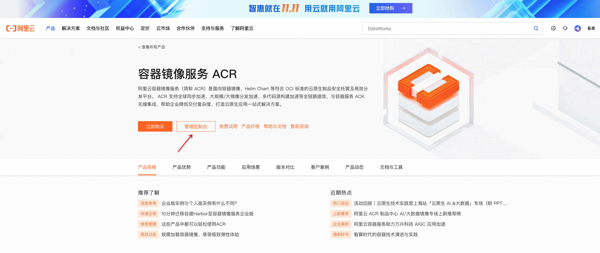
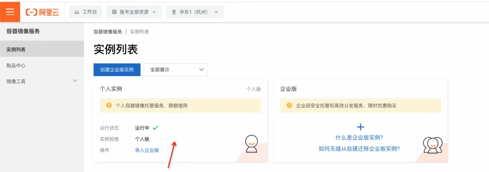
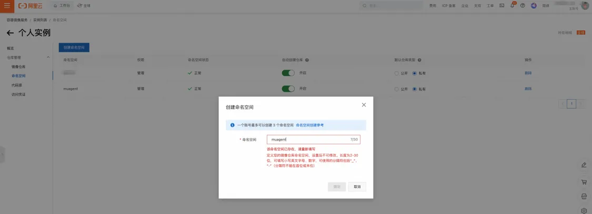
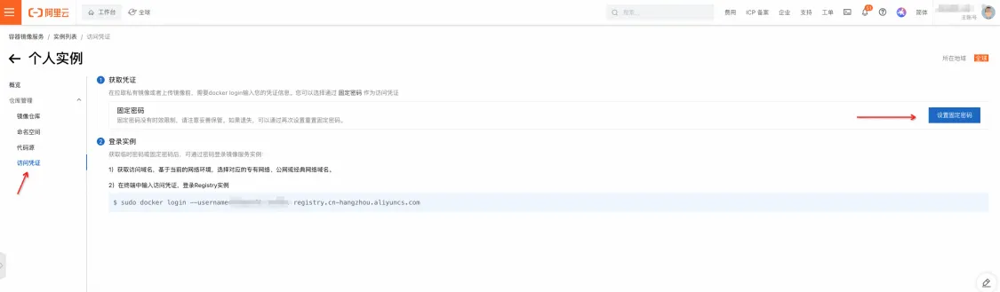
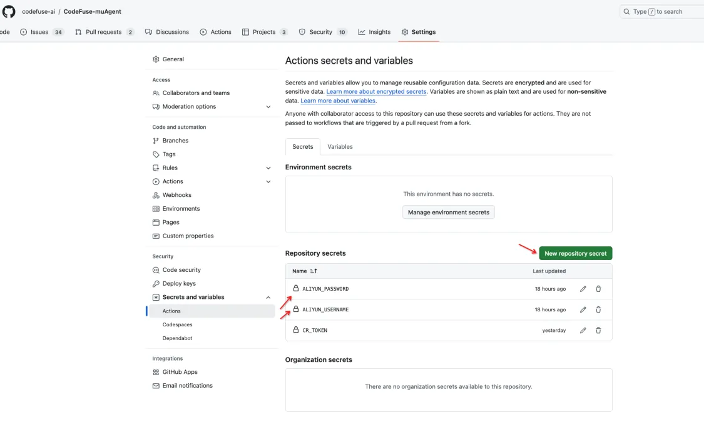
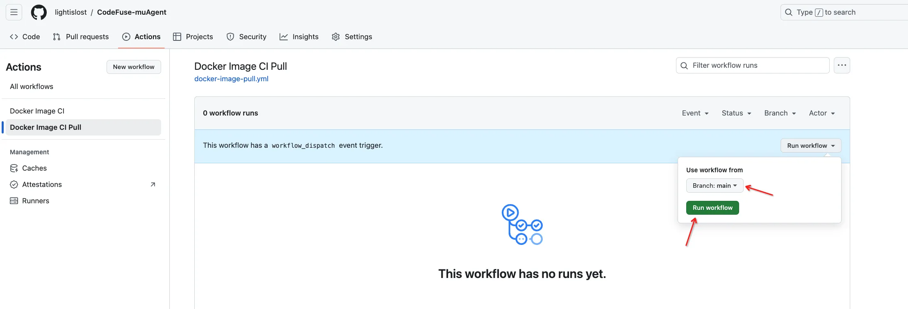

## 1、使用google/baidu 搜索 阿里云镜像服务

## 2、登录后点击管理控制台


## 3、点击个人实例，如果没有就生成一个（免费的）


## 4、创建命名空间，取名 muagent，默认私人仓库


## 5、配置访问凭证


## 6、fork codefuse-muagent仓库

## 7、去fork的仓库settings下配置密钥
```bash
ALIYUN_USERNAME={见访问凭证处的username}
ALIYUN_PASSWWORD={配置访问凭证}
```


## 8、手动触发将指定镜像同步到个人的阿里云镜像，然后执行本地命令进行拉取阿里云镜像


```bash
# 本地执行拉取镜像
# 示例，仅支持ekgfrontend、runtime、muagent；其他镜像根据需求对docker-image-pull进行修改

# 登录阿里云镜像库
docker login --username=xxx registry.cn-hangzhou.aliyuncs.com

# 拉取amd版本的runtime
docker pull registry.cn-hangzhou.aliyuncs.com/muagent/runtime:0.1.0-amd64

# 改成docker-compose.yaml 可以直接使用的版本
docker tag registry.cn-hangzhou.aliyuncs.com/muagent/runtime:0.1.0-amd64 runtime:0.1.0
```
